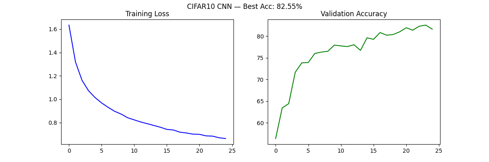

# 基于 Qwen3-VL 的图像问答系统构建、评测与 LoRA 微调
> 多模态视觉问答项目 —— 涵盖 CLIP 图文检索、VQA 零样本推理、三层评分体系与 LoRA 微调全链路。

PyTorch 深度学习工程实践，覆盖 MLP/CNN 基础训练、CLIP 双塔图文检索、Qwen3-VL 零样本 VQA 三大阶段。

## 项目背景
## 项目概述

本项目从零构建多模态图像问答系统：加载 Qwen3-VL-4B-Instruct，设计 6 类 84 条 VQA 测试样本，实现三层评分体系，完成 zero-shot baseline 与 LoRA 微调对比。

| 维度 | 结果 |
|---|---|
| CLIP 图文检索 | Recall@5 100%（120张图，30种描述） |
| VQA zero-shot | human_score 92.3%（84条，6类型） |
| LoRA 微调 | 0.1%参数训练，loss 21→15，链路全通 |
| 评测体系 | 三层评分 + 6类型分项 + 错误归因 |

目标不是追求 SOTA，而是建立"从模型加载、数据构造、推理到评估"的全流程能力。

## 技术栈

`PyTorch 2.11` `CUDA 12.8` `Python 3.10` `CNN` `MLP` `CLIP` `ViT` `BERT` `Qwen3-VL` `VLM` `VQA` `Git`

## 环境

- Python 3.10.20，PyTorch 2.11.0+cu128，CUDA 12.8
- GPU: NVIDIA GeForce RTX 5070 Laptop GPU（8GB 显存）

## 目录结构
├── data/
│   ├── clip_images/    # 120 张合成图文数据（10色×3形状×4变体）
│   ├── vqa_test.json   # 84 条 VQA 测试样本（5类问题）
│   ├── mnist_raw/      # MNIST 数据集
│   └── cifar10/        # CIFAR10 数据集
├── models/              # 模型定义 + 训练好的权重
├── scripts/
│   ├── train_mnist.py  # MNIST MLP 训练
│   ├── train_cifar10.py # CIFAR10 CNN 训练
│   ├── clip_demo.py    # CLIP 双塔推理 demo
│   ├── gen_clip_dataset.py  # 合成图文数据集生成
│   ├── text_to_image.py# 文本搜图
│   ├── image_to_text.py# 图搜文 + Recall@K
│   ├── vlm_demo.py     # VLM 单图问答 demo
│   └── run_vqa_eval.py # 批量 VQA 推理
├── outputs/             # 推理结果（json + csv）
├── notes/
│   ├── clip_vs_vlm.md  # CLIP 与 VLM 对比笔记
│   ├── error_analysis.md    # VQA 错误分析
│   └── vlm_model_choice.md  # 模型选择笔记
├── utils/               # 训练曲线、工具函数
└── README.md
## 第 1 周：PyTorch 工程基础

### MNIST (MLP)

| 模型 | 准确率 |
|------|--------|
| 2层全连接 (784→128→10) | 96.91% |

### CIFAR10 (CNN)

| 实验 | 配置 | 准确率 |
|------|------|--------|
| baseline | CNN, 无增强, 无 BN, 10 epochs | 79.07% |
| 升级版 | +数据增强 +BatchNorm +GPU, 25 epochs | **82.55%** |



## 第 2 周：CLIP 图文检索

### 概述

加载中文 CLIP 模型（ViT-B/16-Patch16-zh），拆解双塔推理链路：open_clip 驱动 ViT 图片编码器 + transformers 驱动 BERT 文本编码器。构造 120 张合成图文数据集（10 种颜色 × 3 种形状 × 4 种尺寸变体），实现文本搜图和图搜文双向检索。

### 核心指标

| 指标 | 结果 |
|------|------|
| 数据集规模 | 120 张图，30 种唯一描述 |
| Recall@1 | 93.3% |
| Recall@5 | 100% |
| Recall@10 | 100% |

### 运行方式

```bash
python scripts/clip_demo.py        # CLIP 双塔推理验证
python scripts/gen_clip_dataset.py # 生成合成图文数据集
python scripts/text_to_image.py    # 文本搜图
python scripts/image_to_text.py    # 图搜文 + Recall@K
```

### 关键收获

- 理解对比学习损失（CLIP Loss）和文本投影矩阵（text_projection [768, 512]）
- 掌握 L2 归一化 + 点积 = 余弦相似度的原理
- 熟练 Recall@K 评估指标的代码实现和语义

## 第 3 周：VLM 零样本视觉问答

### 概述

加载 Qwen3-VL-4B-Instruct 视觉语言模型，在 8GB RTX 5070 笔记本上实现零样本 VQA。构造 31 条覆盖 5 类问题（颜色、形状、数量、空间关系、真实物体）的测试集，批量推理并完成人工评测。

### 模型信息

| 项目 | 详情 |
|------|------|
| 模型 | Qwen3-VL-4B-Instruct |
| 参数量 | 4B（Dense） |
| 下载方式 | ModelScope snapshot_download |
| 显存占用 | ~8GB（FP16） |

### 单图问答示例

| 图片 | 问题 | 模型回答 |
|------|------|----------|
| 红色方块 | "这是什么形状？什么颜色？" | "这是一个正方形，颜色是红色。四条边相等、四个角都是直角..." |
| 哈士奇照片 | "这是什么？" | "这是一张哈士奇犬的照片。毛色为经典的黑白灰三色，耳朵竖立..." |
| 路牌照 | "左边是什么？右边是什么？" | "左边是恒通路路牌（东西方向），右边是恒通交通路牌（南北方向）" |

### VQA 评测结果

| 指标 | 数值 |
|------|------|
| 测试集规模 | 31 条，覆盖 5 类问题 |
| 简单匹配正确率 | 22/31 |
| 假错（答对但措辞不同） | 7 条 |
| 真错（数量判断错误） | 2 条 |
| 修正后实际正确率 | **29/31 ≈ 93.5%** |

### 失败案例分析

2 条真错全部出现在数量类问题：模型把背景元素（白色小花、相机图标）也计入了"有几个物体"，说明 4B 模型对物体边界的定义过于宽泛。详见 `notes/error_analysis.md`。

### CLIP vs VLM

| 维度 | CLIP | VLM |
|------|------|-----|
| 架构 | 双塔（ViT + BERT） | 三段（视觉编码器 + 投影层 + LLM） |
| 输出 | 相似度分数 | 自然语言回答 |
| 图文处理 | 分开编码，最后余弦相似度 | token 拼接后统一 Transformer |
| 训练目标 | 对比学习 | 下一个 token 预测 |
| 能做什么 | 检索、匹配 | 问答、描述、推理 |

详见 `notes/clip_vs_vlm.md`。

### 运行方式

```bash
# D1: 下载模型
python -c "from modelscope import snapshot_download; snapshot_download('Qwen/Qwen3-VL-4B-Instruct')"

# D2: 单图问答
python scripts/vlm_demo.py

# D5: 批量 VQA 推理
python scripts/run_vqa_eval.py
```

### 第四周是否进入微调

已满足全部准入条件（单图跑通、批量跑通、30+ 测试集、错误分析完成、CLIP vs VLM 笔记完成），第四周可进入 LoRA/QLoRA 微调，优先针对数量判断和物体边界识别做优化。

## 简历 Bullet 初稿

- 独立搭建 PyTorch 工程环境，完成 MNIST/CIFAR10 两个数据集的网络设计、训练与 GPU 部署（RTX 5070），MNIST 96.91%，CIFAR10 82.55%
- 复现 CLIP 双塔图文检索：加载中文 CLIP（ViT-B/16 + BERT），构造 120 张合成图文数据集，实现文本搜图和图搜文双向检索，Recall@5 达 100%
- 部署 Qwen3-VL-4B-Instruct 零样本 VQA：构造 31 条多类型测试集，独立完成批量推理与人工评测，修正正确率 93.5%，完成系统化错误分析
- 掌握 CNN/MLP/Transformer/ViT/BERT 模型原理，熟练 PyTorch 训练循环、数据增强、BatchNorm 及 Git 规范化工作流（20+ commits）

## 第 4 周：VLM 项目增强与 LoRA 微调入门

### 概述

在第 3 周 zero-shot baseline 基础上，将 VQA 测试集从 31 条扩展到 84 条（覆盖 6 类问题），升级评分方式（exact_match → keyword_match），固定 zero-shot baseline，并基于 PEFT 库完成 QLoRA 小规模微调尝试。

### VQA 数据集 v2

| 指标 | 数值 |
|------|------|
| 总样本数 | 84 条 |
| 问题类型 | 6 类（color_shape / count / object / spatial / ocr / edge） |
| 训练/验证/测试 | 58 / 13 / 13（70/15/15 拆分） |
| 数据源 | clip_images 合成图 + 真实/AI 生成图片 |

### Zero-shot Baseline

| 评分方式 | 结果 |
|------|------|
| exact_match | 52/84（61.9%） |
| keyword_match | 65/84（77.4%） |

| 问题类型 | keyword_match |
|------|------|
| spatial（空间关系） | 11/12（91.7%） |
| color_shape（颜色形状） | 16/18（88.9%） |
| ocr（文字识别） | 11/13（84.6%） |
| object（物体识别） | 7/10（70.0%） |
| count（数量判断） | 17/26（65.4%） |
| edge（物体边界） | 3/5（60.0%） |

### LoRA/QLoRA 微调

| 项目 | 详情 |
|------|------|
| 微调方式 | PEFT LoRA（rank=8, alpha=16） |
| 可训练参数 | 4,866,048（占总参数 0.1%） |
| 目标模块 | q_proj, v_proj, o_proj |
| 训练数据 | 58 条 SFT 格式 |
| 框架 | PEFT + Transformers Trainer |

### 运行方式

```bash
# D5: 数据格式转换
python scripts/convert_sft_data.py

# D6: LoRA 微调
python scripts/train_lora.py

# D1-D2: 批量推理 + 评分
python scripts/run_vqa_eval.py
python scripts/evaluate_results.py
```

### 关键收获

- 理解 LoRA/QLoRA 原理：低秩分解 + 量化，8GB 显存即可微调 4B VLM
- 掌握 PEFT 库的 LoraConfig、get_peft_model、Trainer 训练流程
- 学会数据分析闭环：找短板（count/edge）→造数据→微调→看改善